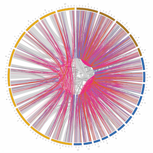

---
# Feel free to add content and custom Front Matter to this file.
# To modify the layout, see https://jekyllrb.com/docs/themes/#overriding-theme-defaults

layout: home
---
{:refdef: style="text-align: center;"}

{: refdef}
[Commented  text]: Above: macrosyntenic regions within and between three grass genomes